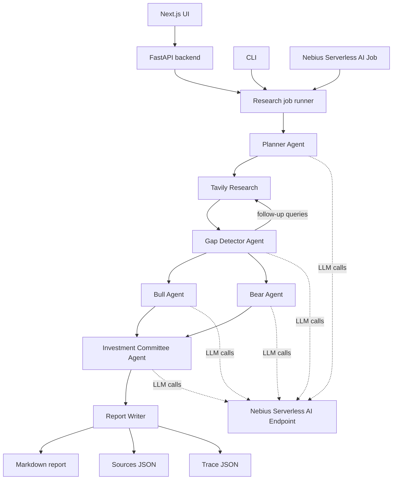

# OpenResearch Analyst

OpenResearch Analyst is a reproducible multi-agent company research system built
for the Nebius Serverless AI Builders Challenge. A user enters a company and
ticker, for example `Nebius / NBIS`, and the system gathers web evidence with
Tavily, reasons over that evidence with a Nebius Serverless AI Endpoint, and
writes an educational investment-style research report.

This project is **not financial advice**. It is an educational AI research demo.

## Challenge Fit

This submission uses both core Nebius Serverless AI services:

| Nebius service | How it is used |
| --- | --- |
| Serverless AI Endpoint | Hosts an OpenAI-compatible LLM server, such as vLLM. All planner, gap detector, bull/bear, and committee LLM calls go to `NEBIUS_ENDPOINT_URL`. |
| Serverless AI Job | Runs the containerized research workflow to completion with `python -m backend.app.jobs.research_job ...`. |

The local and web UI paths use the same backend workflow as the job path.

## Architecture



## Repository Layout

```text
backend/
  app/
    agents/       # planner, gap detector, bull/bear, committee
    jobs/         # CLI and Nebius Job entrypoint
    services/     # Nebius endpoint client, Tavily client, report writer
    schemas/      # request, run, source, trace, progress models
    main.py       # FastAPI backend
frontend/         # Next.js web interface
reports/          # local runtime outputs, gitignored except .gitkeep
examples/         # committed example outputs
docs/             # Nebius and architecture notes
Dockerfile        # backend/job image
```

## Requirements

- Python 3.9+
- Node.js 20+
- Docker with buildx
- Tavily API key
- Nebius project with AI Services access
- A running Nebius Serverless AI Endpoint for LLM inference

## Environment Variables

Create `.env` from the example:

```bash
cp .env.example .env
```

Required:

| Variable | Description |
| --- | --- |
| `NEBIUS_ENDPOINT_URL` | OpenAI-compatible chat completions URL for the Nebius Serverless AI Endpoint, for example `http://<endpoint-host>/v1/chat/completions`. |
| `NEBIUS_MODEL` | Model name served by the endpoint, for example `Qwen/Qwen3-0.6B`. Must match the model used by vLLM. |
| `TAVILY_API_KEY` | Tavily API key used for web research. |

Optional:

| Variable | Default | Description |
| --- | --- | --- |
| `NEBIUS_ENDPOINT_TOKEN` | empty | Bearer token if token authentication is enabled on the Nebius endpoint. Leave empty if endpoint auth is disabled. |
| `REPORTS_DIR` | `reports` | Output directory for generated artifacts. |
| `MAX_GAP_ITERATIONS` | `1` | Number of gap-detection passes. |
| `MAX_RESULTS_PER_QUERY` | `3` | Tavily results per query. |
| `MAX_FOLLOW_UP_QUERIES` | `2` | Maximum follow-up queries generated by the gap detector. |

Do not commit `.env`. It is ignored by `.gitignore`.

## Nebius Serverless AI Endpoint

Create an endpoint in **AI Services → Endpoints**.

Recommended demo configuration:

```text
Image:
vllm/vllm-openai:v0.18.0-cu130

Port:
8000

Entrypoint command:
python3 -m vllm.entrypoints.openai.api_server --model Qwen/Qwen3-0.6B --host 0.0.0.0 --port 8000
```

Use GPU compute for the endpoint. The endpoint serves the LLM and exposes:

```text
/v1/chat/completions
```

Set local/job env vars:

```env
NEBIUS_ENDPOINT_URL=http://<endpoint-host>/v1/chat/completions
NEBIUS_MODEL=Qwen/Qwen3-0.6B
NEBIUS_ENDPOINT_TOKEN=
```

If endpoint token authentication is enabled, put the token in
`NEBIUS_ENDPOINT_TOKEN`. The backend sends `Authorization: Bearer ...` only when
that value is present.

Smoke-test the endpoint:

```bash
source .venv/bin/activate
python scripts/test_nebius_endpoint.py
```

## Local Backend

```bash
python -m venv .venv
source .venv/bin/activate
pip install -r requirements.txt
uvicorn backend.app.main:app --host 0.0.0.0 --port 8000
```

Check:

```bash
curl http://localhost:8000/health
```

Expected:

```json
{"status":"OK"}
```

## Local Frontend

```bash
cd frontend
npm install
npm run dev
```

Open:

```text
http://localhost:3000
```

The UI calls the FastAPI backend at `NEXT_PUBLIC_API_BASE`, defaulting to:

```text
http://localhost:8000
```

The UI shows live backend progress, including planning, Tavily search, gap
detection, bull/bear analysis, committee synthesis, and artifact writing.

## CLI Usage

Run the workflow directly:

```bash
python -m backend.app.jobs.research_job \
  --company "Nebius" \
  --ticker "NBIS" \
  --goal "Generate an investment research report"
```

Expected local outputs:

```text
reports/NBIS_research_report.md
reports/NBIS_sources.json
reports/NBIS_trace.json
```

## API Usage

Start a run:

```bash
curl -X POST http://localhost:8000/research \
  -H "Content-Type: application/json" \
  -d '{
    "company": "Nebius",
    "ticker": "NBIS",
    "goal": "Generate an investment research report"
  }'
```

Poll status:

```bash
curl http://localhost:8000/research/<run_id>
```

The response includes:

- run status
- latest progress step
- recent progress events
- final artifact paths when complete

## Docker

Build the backend/job image locally:

```bash
docker build -t openresearch-analyst .
```

Run locally:

```bash
docker run --env-file .env -p 8000:8000 -v "$PWD/reports:/app/reports" openresearch-analyst
```

For Nebius Intel/AMD CPU jobs, build and push an AMD64 image:

```bash
docker buildx build \
  --platform linux/amd64 \
  -t cr.eu-north1.nebius.cloud/<registry>/openresearch-analyst:latest \
  --push .
```

The Docker image is intentionally backend/job focused. The Next.js frontend can
run locally or be deployed separately.

## Nebius Serverless AI Job

Create a job in **AI Services → Jobs** using the pushed image:

```text
Image:
cr.eu-north1.nebius.cloud/<registry>/openresearch-analyst:latest

Compute:
CPU, Intel/AMD platform

Entrypoint command:
python -m backend.app.jobs.research_job --company "Nebius" --ticker "NBIS" --goal "Generate an investment research report"
```

Job environment variables:

```env
NEBIUS_ENDPOINT_URL=http://<endpoint-host>/v1/chat/completions
NEBIUS_MODEL=Qwen/Qwen3-0.6B
NEBIUS_ENDPOINT_TOKEN=
TAVILY_API_KEY=<your_tavily_key>
MAX_GAP_ITERATIONS=1
MAX_RESULTS_PER_QUERY=3
MAX_FOLLOW_UP_QUERIES=2
```

Successful job logs end with:

```text
Report: reports/NBIS_research_report.md
Sources: reports/NBIS_sources.json
Trace: reports/NBIS_trace.json
```

If the job filesystem is not persisted, use the logs as proof of job completion
and run the same workflow locally to regenerate artifacts for `examples/`.

## Expected Outputs

Every run writes three reproducible artifacts:

```text
reports/{TICKER}_research_report.md
reports/{TICKER}_sources.json
reports/{TICKER}_trace.json
```

The report includes:

- executive summary
- business overview
- recent developments
- competitive landscape
- bull case
- bear case
- key risks
- metrics to watch
- neutral conclusion
- source references
- educational research disclaimer

The trace includes agent steps, queries, source counts, timestamps, and outputs.

Example committed outputs are in:

```text
examples/
```

After generating a real NBIS run, refresh the examples:

```bash
cp reports/NBIS_research_report.md examples/NBIS_research_report.md
cp reports/NBIS_sources.json examples/NBIS_sources.json
cp reports/NBIS_trace.json examples/NBIS_trace.json
```

## Hardware Configuration

Recommended challenge/demo configuration:

| Component | Hardware |
| --- | --- |
| Nebius LLM Endpoint | GPU endpoint for vLLM, model-dependent sizing. Tested flow used a small Qwen model for demo speed. |
| Nebius Job | CPU Intel/AMD platform. The job does not run model weights; it orchestrates Tavily and the LLM endpoint. |
| Local backend | Any modern laptop/desktop Python environment. |
| Local frontend | Node.js development server. |

## Runtime and Cost

Runtime depends on endpoint warmup, model size, Tavily latency, and configured
search depth. With the demo defaults:

```env
MAX_GAP_ITERATIONS=1
MAX_RESULTS_PER_QUERY=3
MAX_FOLLOW_UP_QUERIES=2
```

a run typically performs:

- 8 initial Tavily searches
- up to 2 follow-up Tavily searches
- 5 core LLM calls
- one final markdown/source/trace write

For the NBIS demo, expect a few minutes end-to-end. Costs depend on Nebius GPU
endpoint runtime, CPU job runtime, selected model, and Tavily usage. Stop the
endpoint when not demoing to avoid idle endpoint cost.

## Limitations

- This is educational research, not investment advice.
- Source quality depends on Tavily results and public web availability.
- The system cites gathered sources but does not independently audit facts.
- If data is missing or stale, the report should state uncertainty.
- The local FastAPI run registry is in memory and not intended as production
  job storage.
- For public live demos, deploy the backend as a long-running HTTP service or
  Nebius Endpoint; a Nebius Job runs to completion and is not itself an API.

## Submission Notes

For a valid challenge submission, include:

- public GitHub/GitLab repository
- Dockerfile
- README setup and Nebius instructions
- open-source license
- no committed secrets
- screenshots/logs showing:
  - Nebius Serverless AI Endpoint running
  - Nebius Serverless AI Job completed
  - job logs with report/source/trace paths
- blog post of at least 600 words tagged `#NebiusServerlessChallenge`

## License

MIT. See `LICENSE`.
