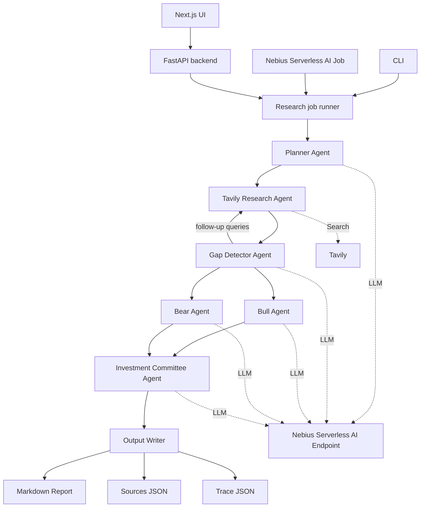

# OpenResearch Analyst Architecture

OpenResearch Analyst is a reproducible multi-agent research workflow for the
Nebius Serverless AI Builders Challenge. A run starts with a company and ticker,
uses Tavily for web evidence retrieval, uses a Nebius Serverless AI Endpoint for
agent reasoning, and writes three artifacts: a markdown report, source list, and
trace.



## Components

- `frontend/`: Next.js web interface for starting research runs, polling status,
  showing live progress, previewing markdown reports, and opening artifacts.
- `backend/app/main.py`: FastAPI entrypoint, static report host, and in-memory
  async run registry for local/demo API usage.
- `backend/app/jobs/research_job.py`: CLI and Nebius Serverless AI Job entrypoint.
- `backend/app/agents`: Planner, gap detector, bull, bear, and committee agents.
- `backend/app/services`: Nebius endpoint client, Tavily wrapper, and artifact writer.
- `backend/app/schemas`: Pydantic models for requests, sources, traces, progress,
  and runs.

## Tavily Retrieval

Tavily is used as the web search/retrieval layer. It gives the agents structured
search results with titles, URLs, snippets/content, dates when available, and
the query used. It is similar in purpose to giving an AI system web search:
Tavily finds evidence, while the Nebius-hosted model reasons over that evidence.

Tavily does not call Nebius and does not generate the report. The backend
orchestrates both services:

```text
research workflow -> Tavily search -> sources
research workflow -> Nebius Endpoint -> LLM reasoning/report writing
```

## Reproducibility

Every run writes:

- `reports/{TICKER}_research_report.md`
- `reports/{TICKER}_sources.json`
- `reports/{TICKER}_trace.json`

The trace includes each agent step, prompt input summaries, outputs, search
queries, source counts, and timestamps. The API also exposes live progress events
for the UI while a run is active.
